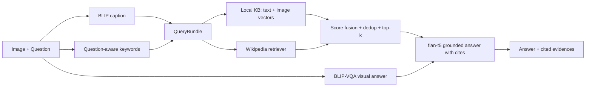

# 基于 RAG 的图像问答（RAG-VQA）

输入图像和自然语言问题，系统生成图文融合查询，从本地知识库与可选互联网证据中召回支撑材料，过滤重排后输出**带证据引用**的可解释答案。

## 系统架构



四路证据融合：
- **Visual reasoning**：BLIP caption 给出全局语义；BLIP-VQA 直接看图回答短答。
- **Text retrieval**：SentenceTransformer 向量化的本地文本知识库。
- **Image retrieval**：CLIP 编码的本地图库（可选）。
- **Web retrieval**：Wikipedia API（`--web`）。

## 功能对应

- Step 1 Query 生成：BLIP 图像描述 + 问题关键词抽取 → `QueryBundle`。
- Step 2 内容检索：本地文本/图像向量检索 + 可选 Wikipedia 检索。
- Step 3 证据整理：相似度排序、去重、Top-k 截断、来源与分数结构化封装。
- Step 4 回答生成：flan-t5 融合图像描述、视觉 VQA 答案与证据片段，输出含引用的答案。

## 安装

```bash
python -m venv .venv
# Windows cmd: .venv\Scripts\activate
source .venv/bin/activate
pip install -r requirements.txt
```

首次运行会自动下载 Hugging Face 模型。算力受限时代码会回退到轻量规则与哈希向量，仍可跑通流程。

## 快速运行

构建本地知识库索引：

```bash
python -m rag_vqa.cli build-index  --kb data/knowledge_base/sample_knowledge.jsonl  --index-dir outputs/index
```

对一张图提问：

```bash
python -m rag_vqa.cli ask  --image /path/to/image.jpg  --question "What is the historical significance of this iron tower?"  --kb data/knowledge_base/sample_knowledge.jsonl --index-dir outputs/index  --web
```

纯文本检索

```bash
python -m rag_vqa.cli eval-retrieval `
  --eval data/eval/retrieval_eval.jsonl `
  --kb data/knowledge_base/sample_knowledge.jsonl `
  --index-dir outputs/index `
  --output outputs/retrieval_eval.json
```

样例输出格式见 `examples/demo_output.json`。

一键 demo：

```bash
# Linux / macOS
bash scripts/run_demo.sh /path/to/image.jpg "Your question"
# Windows PowerShell
pwsh scripts/run_demo.ps1 -Image "C:/path/to/image.jpg" -Question "Your question"
```

启动可视化 Demo：

```bash
python -m rag_vqa.cli serve --web --port 7860
```

调试模式打印中间变量到 `stderr`：

```bash
python -m rag_vqa.cli ask --image ... --question "..." --debug
```

## Results

### Retrieval coverage ablation（55-question internal benchmark）

跑 `scripts/run_demo.*` 之外的复现命令（见下文）后，在 `outputs/retrieval_eval.json` 得到：

| metric     | baseline (question-only) | full (question + BLIP caption + keywords) | delta | relative |
|------------|--------------------------|--------------------------------------------|-------|----------|
| Recall@1   | 0.6364 | 0.8000 | +16.4 pts | +25.7% |
| Recall@3   | 0.7636 | 0.9273 | +16.4 pts | +21.4% |
| Recall@5   | 0.8727 | 0.9636 | +9.1 pts  | +10.4% |
| Recall@10  | 0.9455 | 1.0000 | +5.5 pts  | +5.8%  |
| Hit@5      | 0.8727 | 0.9636 | +9.1 pts  | +10.4% |

简历英文写法（数字以真实输出为准）：

> *Constructed joint image-text queries combining BLIP captions with question-aware keyword extraction; lifted retrieval Recall@5 from 0.873 to 0.964 (+10% relative) and Recall@1 from 0.636 to 0.800 (+26%) on a 55-question internal benchmark with manually labeled gold documents.*

### OKVQA val accuracy

OKVQA 数据需要手动下载，参见下一节的复现步骤。`outputs/okvqa_eval.json` 里会写入总分与按 `question_type` / `answer_type` 的分项。简历最终引用的分数以这个文件里的 `overall_accuracy_pct` 为准。

## Reproduce metrics

下面三条命令复现简历里两条数字指标：

### 1. 检索覆盖率消融（baseline 仅问题 vs 完整 query）

```bash
python -m rag_vqa.cli eval-retrieval \
  --eval data/eval/retrieval_eval.jsonl \
  --kb data/knowledge_base/sample_knowledge.jsonl \
  --index-dir outputs/index \
  --output outputs/retrieval_eval.json
```

输出会打印每个 k 上的 baseline / full 对比，如 Recall@5、Hit@5。详细每条样本的命中情况写入 `outputs/retrieval_eval.json`。
评测集位于 `data/eval/retrieval_eval.jsonl`：每条标注一个或多个 `gold_doc_ids`，`synthetic_caption` 字段模拟 BLIP 输出，使评测无需真实图片即可复现；如有真实图片，可加 `--use-blip-caption` 让 BLIP 重新生成 caption。

### 2. OKVQA 端到端评测

第一步：从 [OKVQA 官网](https://okvqa.allenai.org/download.html) 下载并放置：

```
data/okvqa/
  OpenEnded_mscoco_val2014_questions.json
  mscoco_val2014_annotations.json
  mscoco_train2014_annotations.json    # 用于构建 KB
data/okvqa/images/                     # COCO val2014 图像
```

第二步：构建 OKVQA 本地 KB（避免远程 Wikipedia 在大批量评测下被限流）：

```bash
python scripts/build_okvqa_kb.py \
  --train-annotations data/okvqa/mscoco_train2014_annotations.json \
  --output data/knowledge_base/okvqa_kb.jsonl \
  --max-pages 4000

python -m rag_vqa.cli build-index \
  --kb data/knowledge_base/okvqa_kb.jsonl \
  --index-dir outputs/okvqa_index
```

第三步：先用 200 条试跑（10–20 分钟左右），再跑全量（5046 条）：

```bash
python -m rag_vqa.cli eval-okvqa \
  --questions data/okvqa/OpenEnded_mscoco_val2014_questions.json \
  --annotations data/okvqa/mscoco_val2014_annotations.json \
  --images-dir data/okvqa/images \
  --kb data/knowledge_base/okvqa_kb.jsonl \
  --index-dir outputs/okvqa_index \
  --output outputs/okvqa_eval.json \
  --cache-caption \
  --limit 200
```

去掉 `--limit 200` 即跑完整 val。详细分数与按问题类型分布写入 `outputs/okvqa_eval.json`。

## 知识库格式

```json
{
  "id": "landmark_eiffel",
  "title": "Eiffel Tower",
  "text": "The Eiffel Tower stands on the Champ de Mars in Paris...",
  "source": "local_demo/wiki_summary",
  "type": "text",
  "image_path": null,
  "tags": ["architecture", "landmark", "Paris"],
  "metadata": {"language": "en"}
}
```

如有图库，把 `image_path` 指向图片，系统会用 CLIP（或回退颜色直方图）做图像向量检索。

## 主要文件

- `rag_vqa/cli.py`：命令行 / Gradio 入口，含 `build-index` / `ask` / `serve` / `eval-retrieval` / `eval-okvqa` 子命令。
- `rag_vqa/pipeline.py`：端到端 RAG-VQA 流水线。
- `rag_vqa/vision.py`：BLIP 图像描述 / 视觉问答（带 caption 缓存）。
- `rag_vqa/query.py`：图文融合 Query 构建。
- `rag_vqa/retriever.py`：本地文本+图像向量库与证据重排。
- `rag_vqa/web_retriever.py`：Wikipedia 外部证据检索。
- `rag_vqa/answer.py`：基于证据的答案生成。
- `rag_vqa/eval/retrieval_eval.py`：检索覆盖率评测。
- `rag_vqa/eval/okvqa_eval.py`：OKVQA 软准确率评测。
- `scripts/build_okvqa_kb.py`：构建 OKVQA 本地知识库。
- `scripts/run_demo.{sh,ps1}`：一键 demo 脚本。
